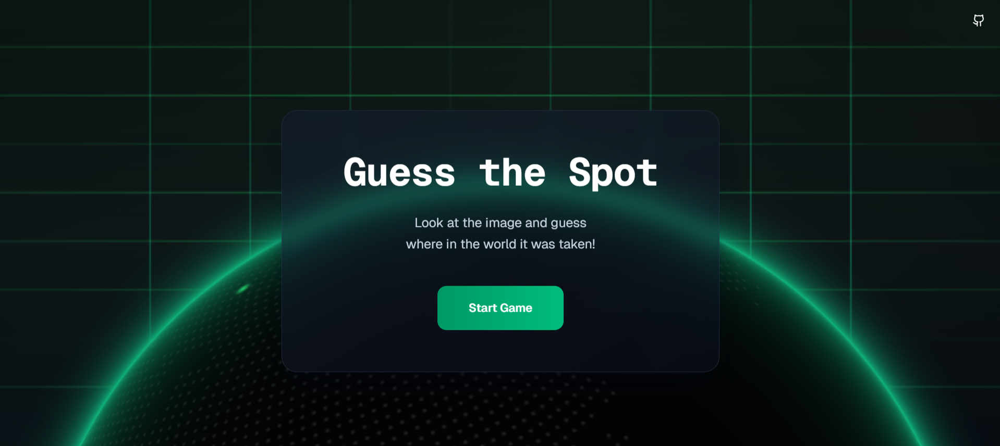
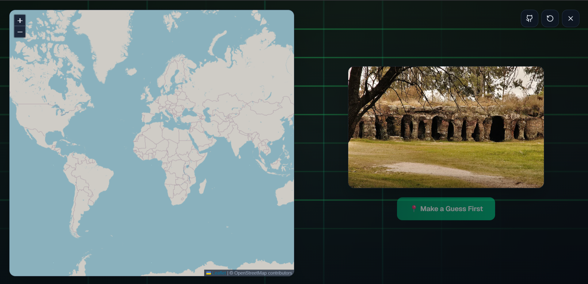
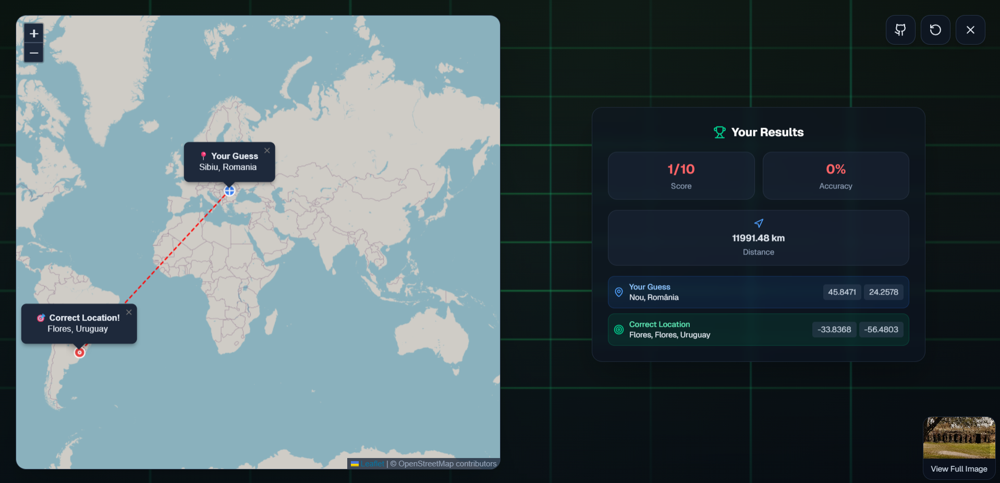

# 🌍 Guess the Spot

A modern, interactive geography guessing game where players look at images and guess their location on a world map. Built with Next.js, TypeScript, and featuring real-world images from multiple sources.

## 📸 Screenshots

### Landing Page

*Beautiful dark-themed landing page with animated globe and grid effects*

### Game Interface

*Interactive map interface where players make their location guesses*

### Results Screen

*Results showing distance, accuracy, and scoring system*

## ✨ Features

- **🎯 Interactive Gameplay**: Click on the world map to make your guess
- **📸 Real Images**: Uses images from Wikimedia Commons and Openverse (no API keys required!)
- **🌍 Global Locations**: Random locations from around the world
- **📊 Scoring System**: Distance-based scoring with percentage accuracy
- **🎨 Modern UI**: Beautiful dark theme with animated globe and grid effects
- **📱 Responsive Design**: Works perfectly on desktop and mobile devices
- **⚡ Fast Performance**: Built with Next.js 15 and optimized for speed
- **🆓 Completely Free**: No API keys or paid services required - works out of the box!

## 🚀 Quick Start

### Prerequisites

- Node.js 18+ 
- npm or yarn

### Installation

1. **Clone the repository**
   ```bash
   git clone https://github.com/Sidmaz666/guessthespot.git
   cd guessthespot
   ```

2. **Install dependencies**
   ```bash
   npm install
   ```

3. **Set up environment variables** (optional)
   ```bash
   cp .env.example .env
   ```
   
   Add your API keys to `.env` (all optional with fallbacks):
   ```env
   # Wikimedia Commons API (optional - has fallbacks)
   WIKIMEDIA_BASE_URL=https://commons.wikimedia.org/w/api.php
   WIKIMEDIA_USER_AGENT=GuessTheSpot (contact@example.com)
   WIKIMEDIA_REFERER=https://guessthespot.app
   
   # Openverse API (optional - has fallbacks)
   OPENVERSE_BASE_URL=https://api.openverse.org/v1/images
   
   # Nominatim/OpenStreetMap API (optional - has fallbacks)
   NOMINATIM_BASE_URL=https://nominatim.openstreetmap.org
   NOMINATIM_USER_AGENT=GuessTheSpot (contact@example.com)
   NOMINATIM_REFERER=https://guessthespot.app
   NOMINATIM_CONTACT_EMAIL=contact@example.com
   
   # API Configuration (optional)
   API_RATE_LIMIT=100
   API_TIMEOUT=30000
   DEFAULT_RADIUS=5000
   ```

4. **Run the development server**
   ```bash
   npm run dev
   ```

5. **Open your browser**
   Navigate to [http://localhost:3000](http://localhost:3000)

## 🎮 How to Play

1. **Start the Game**: Click "Start Game" on the landing page
2. **View the Image**: Look at the provided image carefully
3. **Make Your Guess**: Click anywhere on the world map where you think the image was taken
4. **Submit Your Guess**: Click "Submit Guess" to see how close you were
5. **See Results**: View your distance, score, and accuracy percentage
6. **Play Again**: Start a new round or exit to the main menu

## 🛠️ Tech Stack

- **Framework**: Next.js 15 with App Router
- **Language**: TypeScript
- **Styling**: Tailwind CSS
- **Maps**: Leaflet with React-Leaflet
- **3D Globe**: COBE for the animated globe
- **HTTP Client**: Axios
- **Icons**: Lucide React

## 📁 Project Structure

```
guessthespot/
├── app/                    # Next.js app directory
│   ├── api/               # API routes
│   │   └── loc/           # Location API endpoint
│   ├── globals.css        # Global styles
│   ├── layout.tsx         # Root layout
│   └── page.tsx           # Home page
├── components/            # React components
│   ├── ui/               # UI components
│   ├── GameSection.tsx   # Game interface
│   └── HeroSection.tsx   # Landing page
├── lib/                  # Utility libraries
│   ├── services/         # API services
│   └── gameUtils.ts      # Game logic utilities
├── types/                # TypeScript type definitions
└── public/               # Static assets
```

## 🔧 API Services

The app uses multiple services for location and image data:

### Location Services (`lib/services/get_location.ts`)
- Random geographic location generation
- Regional filtering (continents, countries)
- Urban location generation
- Difficulty-based location selection

### Image Services (`lib/services/get_image.ts`)
- **Wikimedia Commons**: Geotagged images from Wikipedia (free, no API key required)
- **Openverse**: Open-licensed images from various sources (free, no API key required)

### Usage Example
```typescript
import { getNearbyPhotoWithFallback } from './lib/services';

const photo = await getNearbyPhotoWithFallback({
  lat: 40.7128,
  lng: -74.0060,
  radius: 2000
});
```

## 🌐 API Endpoints

### GET `/api/loc`
Returns random location data with nearby images from Wikimedia Commons and Openverse.

**Query Parameters:**
- `continent` (string): Filter by continent (Africa, Americas, Asia, Europe, Oceania, Antarctica)
- `country` (string): Filter by specific country name (minimum 2 characters)
- `includeImage` (boolean): Include nearby image (default: true)
- `imageRadius` (number): Search radius for images in meters (100-50000, default: 5000)
- `maxRetries` (number): Maximum retry attempts for location generation (1-10, default: 3)

**Example Response:**
```json
{
  "success": true,
  "data": {
    "location": {
      "lat": 35.6762,
      "lon": 139.6503,
      "country": "Japan",
      "city": "Tokyo",
      "displayName": "Tokyo Station, Chiyoda, Tokyo, Japan"
    },
    "image": {
      "fileurl": "https://upload.wikimedia.org/...",
      "title": "File:Tokyo Station.jpg",
      "author": "Photographer Name"
    }
  }
}
```

## 🎨 Customization

### Game Configuration
```typescript
const gameConfig = {
  totalRounds: 5,
  difficulty: 'medium',
  imageSources: ['wikimedia', 'openverse'],
  region: 'WORLD'
};
```

## 🙏 Acknowledgments

- [Wikimedia Commons](https://commons.wikimedia.org/) for geotagged photos
- [Openverse](https://openverse.org/) for open-licensed images
- [Nominatim/OpenStreetMap](https://nominatim.openstreetmap.org/) for geocoding services
- [COBE](https://github.com/shuding/cobe) for the beautiful 3D globe
- [Leaflet](https://leafletjs.com/) for interactive maps

---

**Made with ❤️ by [Sidmaz666](https://github.com/Sidmaz666)**